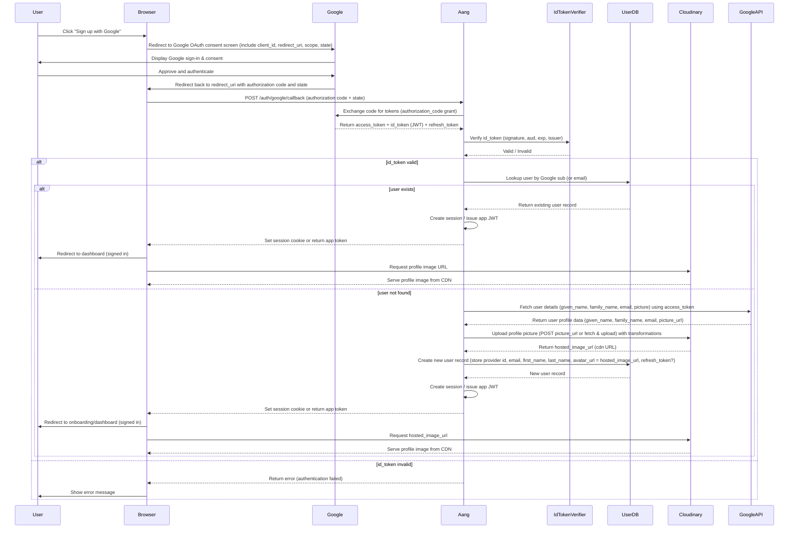
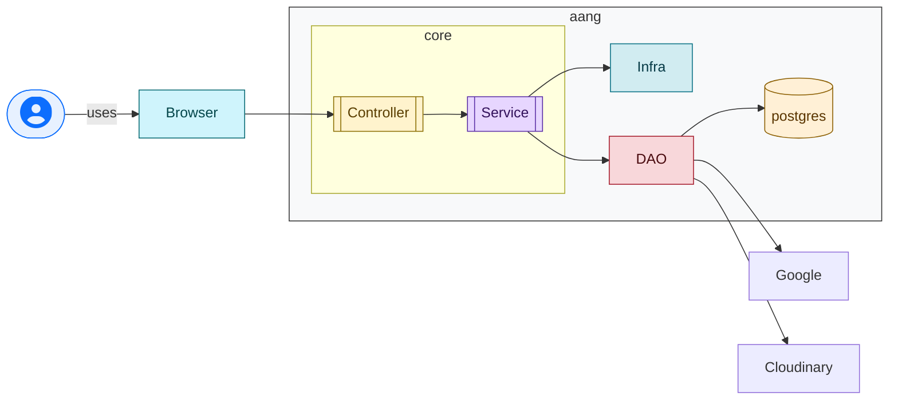

# aang: Design

## High level sequence



## Stack

Design: Monolith

* Because it is easier
* Don't know how the scaling should work
* LLM suggested microservice
* Expecting 10s of users

Monitoring: out of scope

* There will be logs
* monolith does not need monitoring, everyone knows that

Secrets: git-crypt

* I'm familiar with it
* Easy to setup and use compared to something like harshicorp vault
* Not as feature rich as harshicorp vault
* Secrets are left exposed in deployed environment
* Probably puts too much trust in the dev machine

Docker/Podman: Yes

* Can probably use it for testcontainers
* Can use it for postgres
* Can use it for mockserver
* ~Can use it for harshicorp vault~ NO!

Language: Scala with ZIO

* I am more familiar with Scala than Clojure
* I don't want to learn and implement
* I have some code in scala that uses htmx and zio for something like this
* I can use the Java libraries for Google and Cloudinary if needed

Database: postgres

* I like it

## Layout

Uses the actual services in the DAO to encourage full use of the service without trying 
to be generic

```
      .
     ├──  pages -- uses dao and infra to show a page, each folder has a self contained mvc as needed
     │   ├──  landing 
     │   └──  login 
     ├──  dao -- accessing things that are outside of the application
     │   ├──  cloudinary
     │   ├──  google
     │   └──  postgres
     ├──  infra -- building blocks that are needed to build a page. These should be as generic as reasonable
     │   ├──  auditing -- a wrapper on the structured logging library which also handles hiding sensitive and provides ability to log requests and responses
     │   ├──  base -- so that there is a uniform style and metadata on pages
     │   ├──  config
     │   ├──  errors
     │   └──  security
     └──  application.scala - basically kicks off the application
```

## Data flow



## Database

```sql
    CREATE TABLE users (
      id UUID PRIMARY KEY DEFAULT gen_random_uuid(), 
      email CITEXT NOT NULL UNIQUE, -- case insentitive text
      first_name TEXT,
      last_name TEXT,
      avatar_image_url TEXT,
      is_active BOOLEAN NOT NULL DEFAULT TRUE,
      created_at TIMESTAMPTZ NOT NULL DEFAULT now(), -- light auditability
      updated_at TIMESTAMPTZ NOT NULL DEFAULT now()  -- light auditability
    );
```

* No indexes yet, but probably on email if db is slow
* Adding auditing triggers or a table feels like a lot for this thing
