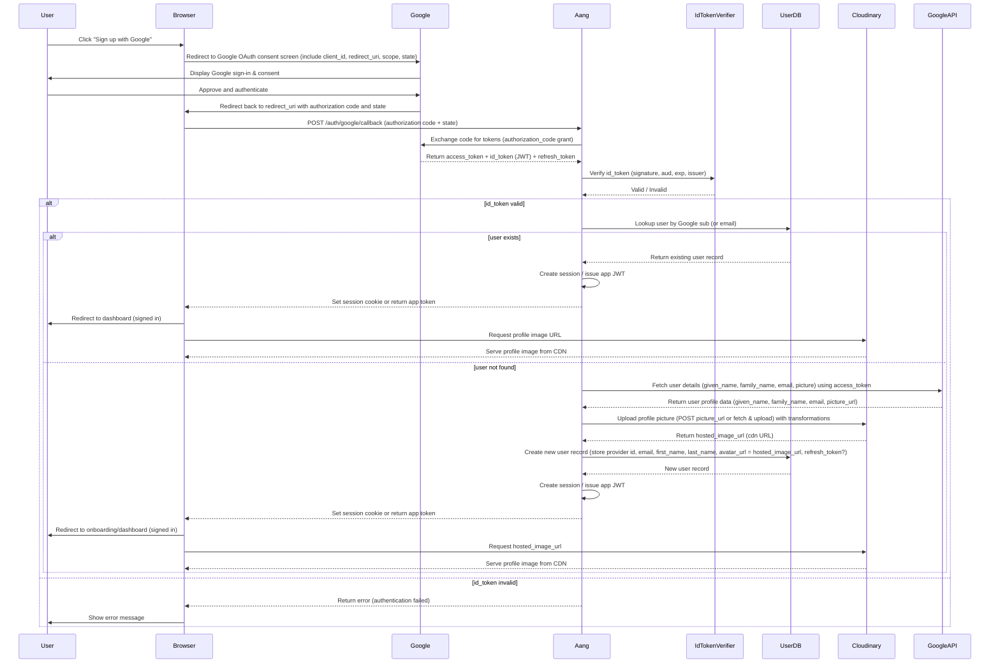

# Aang: Design

## Flow

```mermaid
    sequenceDiagram
        User->>Browser: Click "Sign up with Google"
        Browser->>Google: Redirect to Google OAuth consent screen (include client_id, redirect_uri, scope, state)
        Google->>User: Display Google sign-in & consent
        User->>Google: Approve and authenticate
        Google->>Browser: Redirect back to redirect_uri with authorization code and state
        Browser->>Aang: POST /auth/google/callback (authorization code + state)
        Aang->>Google: Exchange code for tokens (authorization_code grant)
        Google-->>Aang: Return access_token + id_token (JWT) + refresh_token 
        Aang->>IdTokenVerifier: Verify id_token (signature, aud, exp, issuer)
        IdTokenVerifier-->>Aang: Valid / Invalid
        alt id_token valid
            Aang->>UserDB: Lookup user by Google sub (or email)
            alt user exists
                UserDB-->>Aang: Return existing user record
                Aang->>Aang: Create session / issue app JWT
                Aang-->>Browser: Set session cookie or return app token
                Browser->>User: Redirect to dashboard (signed in)
                Browser->>Cloudinary: Request profile image URL
                Cloudinary-->>Browser: Serve profile image from CDN
            else user not found
                Aang->>GoogleAPI: Fetch user details (given_name, family_name, email, picture) using access_token
                GoogleAPI-->>Aang: Return user profile data (given_name, family_name, email, picture_url)
                Aang->>Cloudinary: Upload profile picture (POST picture_url or fetch & upload) with transformations
                Cloudinary-->>Aang: Return hosted_image_url (cdn URL)
                Aang->>UserDB: Create new user record (store provider id, email, first_name, last_name, avatar_url = hosted_image_url, refresh_token?)
                UserDB-->>Aang: New user record
                Aang->>Aang: Create session / issue app JWT
                Aang-->>Browser: Set session cookie or return app token
                Browser->>User: Redirect to onboarding/dashboard (signed in)
                Browser->>Cloudinary: Request hosted_image_url
                Cloudinary-->>Browser: Serve profile image from CDN
            end
        else id_token invalid
            Aang-->>Browser: Return error (authentication failed)
            Browser->>User: Show error message
        end
```
